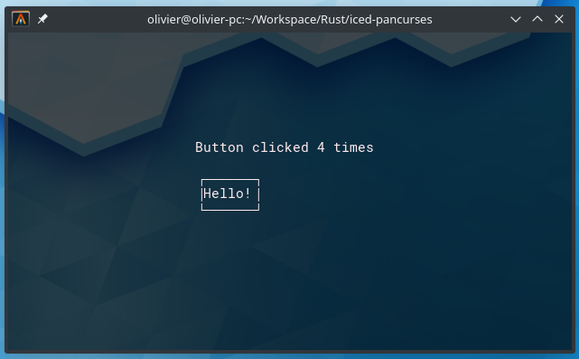

# Iced-pancurses

[](https://travis-ci.org/aliscode/iced-pancurses)
[](https://docs.rs/iced-pancurses)
[](https://crates.io/crates/iced-pancurses)
[](https://github.com/aliscode/iced-pancurses/blob/master/LICENSE)


A toy renderer for [Iced](https://github.com/hecrj/iced), based on the [pancurses](https://github.com/ihalila/pancurses) library.



# Features

* All basic Iced widget 
* Mouse clicking support
* `Sandbox` trait to make prototyping easy

# WIP 

* Scrolling is on the way
* Image support is on the way
    * W3M-IMG support should happen as some point
    * Fallback renderer

# Planned

* Custom Widgets
    * I would love some bottom-bar component
    * SVG-to-ascii backend  

# Installation

Add `iced-native` as a dependency in your `Cargo.toml` :  

```
iced_native = "0.1.0-beta"
iced-pancurses = "0.1.1"
```

# Contributing / Feedback

The use case is admittedly pretty niche, but I would love to see terminal applications being made with it, and iced-pancurses becoming an alternative to `Cursive`. I lack time so if you want to contribute changes by implementing a Renderer for a widget and submitting bugfixes ... 

Please do ! :pray: 